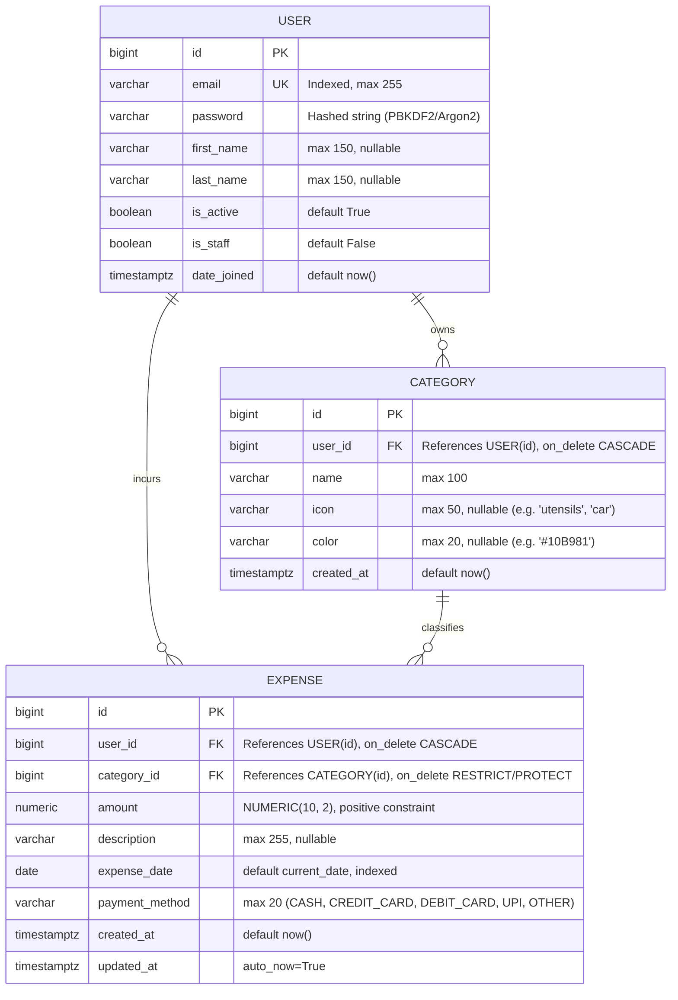

# 03 — Database Design & Data Modeling

## 1. Entity-Relationship (ER) Diagram



---

## 2. Table Schemas & Definitions

### 1. `users_user` (Custom User Model)
| Column | Type | Constraints | Description |
| :--- | :--- | :--- | :--- |
| `id` | `BIGSERIAL` | `PRIMARY KEY` | Auto-incrementing unique user identifier |
| `email` | `VARCHAR(255)` | `UNIQUE, NOT NULL` | Login identifier, indexed |
| `password` | `VARCHAR(128)` | `NOT NULL` | One-way salted hash (never plaintext) |
| `first_name` | `VARCHAR(150)` | `NULL` | Optional user first name |
| `last_name` | `VARCHAR(150)` | `NULL` | Optional user last name |
| `is_active` | `BOOLEAN` | `DEFAULT TRUE` | Account status flag |
| `is_staff` | `BOOLEAN` | `DEFAULT FALSE` | Django admin access flag |
| `date_joined` | `TIMESTAMPTZ` | `DEFAULT NOW()` | Account creation timestamp |

### 2. `categories_category`
| Column | Type | Constraints | Description |
| :--- | :--- | :--- | :--- |
| `id` | `BIGSERIAL` | `PRIMARY KEY` | Unique category identifier |
| `user_id` | `BIGINT` | `FK -> users_user(id), NOT NULL` | The user who owns this category |
| `name` | `VARCHAR(100)` | `NOT NULL` | Name of category (e.g., "Food", "Rent") |
| `icon` | `VARCHAR(50)` | `NULL` | Lucide icon identifier (e.g., `shopping-cart`) |
| `color` | `VARCHAR(20)` | `NULL` | Hex color code for UI charts & badges |
| `created_at` | `TIMESTAMPTZ` | `DEFAULT NOW()` | Timestamp of creation |

* **Unique Constraint:** `UNIQUE(user_id, name)` — A user cannot have two categories with the exact same name, but two different users can each have a "Food" category.

### 3. `expenses_expense`
| Column | Type | Constraints | Description |
| :--- | :--- | :--- | :--- |
| `id` | `BIGSERIAL` | `PRIMARY KEY` | Unique expense transaction identifier |
| `user_id` | `BIGINT` | `FK -> users_user(id), NOT NULL` | Owner of the expense |
| `category_id` | `BIGINT` | `FK -> categories_category(id), NOT NULL` | Associated category |
| `amount` | `NUMERIC(10, 2)` | `NOT NULL, CHECK (amount > 0)` | Monetary value with fixed precision |
| `description` | `VARCHAR(255)` | `NULL` | Memo or note regarding the expense |
| `expense_date` | `DATE` | `NOT NULL, INDEXED` | Date when the expense occurred |
| `payment_method`| `VARCHAR(20)` | `DEFAULT 'CASH'` | Method of payment |
| `created_at` | `TIMESTAMPTZ` | `DEFAULT NOW()` | Record creation timestamp |
| `updated_at` | `TIMESTAMPTZ` | `DEFAULT NOW()` | Record last modification timestamp |

---

## 3. Critical Design Decisions

### Decimal/Numeric vs. Float for Currency
In computing, standard binary floating-point numbers (`IEEE-754` format used by `float` / `double`) represent fractions as sums of powers of 2. Because numbers like `0.1` cannot be represented exactly in binary, repeated arithmetic accumulates rounding errors:
```python
# IEEE-754 Floating-Point Inaccuracy:
>>> 0.1 + 0.2
0.30000000000000004
```
In financial software, this is intolerable. Expensus uses **`DecimalField(max_digits=10, decimal_places=2)`** which translates to PostgreSQL's **`NUMERIC(10, 2)`**. This stores decimal numbers in base-10 with exact mathematical precision, up to $99,999,999.99.

### Foreign Key Cascade Rules (`on_delete`)
1. **`User` -> `Category` / `Expense` (`on_delete=models.CASCADE`):** If a user account is deleted, all their associated categories and expense records are deleted cleanly via database cascade.
2. **`Category` -> `Expense` (`on_delete=models.PROTECT`):** If a user attempts to delete a category that currently has active expenses assigned to it, the database will block the deletion to prevent accidental orphaned expenses. The user must first reassign or delete the expenses.

### Indexing Strategy
* **`users_user.email`:** Unique B-tree index for instant $O(\log n)$ user lookups on authentication.
* **`expenses_expense.user_id`:** B-tree index automatically generated for the foreign key, ensuring multi-tenant queries (`WHERE user_id = ?`) are immediate.
* **`expenses_expense.expense_date`:** B-tree index to accelerate date-range filtering (`WHERE expense_date BETWEEN ? AND ?`) and sorting for dashboard views.
* **Composite Index `(user_id, expense_date)`:** Optimized for user-specific historical date range filtering and sorting.
