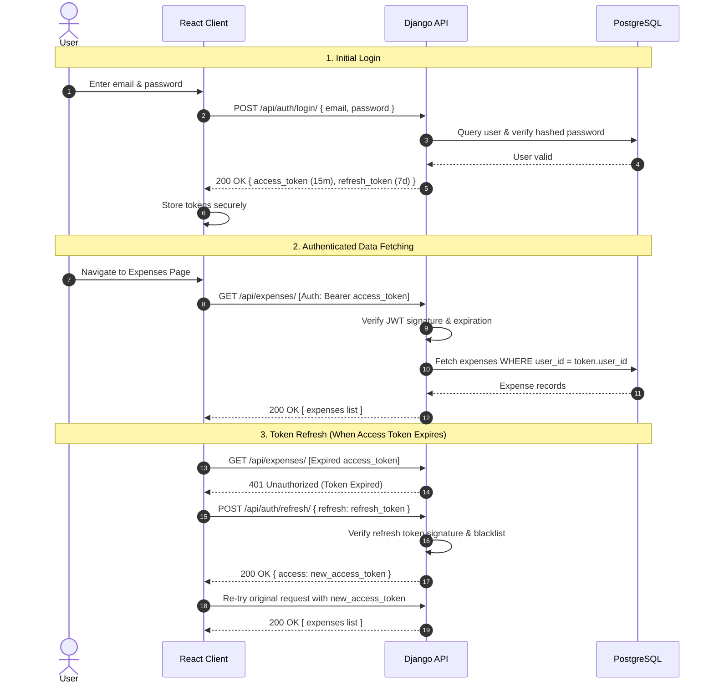

# 05 — Authentication & Security Architecture

## 1. Authentication Strategy: JSON Web Tokens (JWT)

Expensus utilizes **Stateless JWT Authentication** powered by `djangorestframework-simplejwt`. 

### Why JWT over Session Cookies?
1. **Stateless API Backend:** The backend does not need a session table in PostgreSQL or an in-memory session cache (like Redis) to verify user identity. Every request contains a cryptographic signature verifiable by the server's secret key.
2. **Decoupled Client Architecture:** The React frontend runs on a separate port or domain in development (`localhost:5173`) from the Django backend (`localhost:8000`), making token-based authorization via standard `Authorization: Bearer <token>` headers clean and immune to third-party cookie restrictions.

---

## 2. Anatomy of a JWT

A JSON Web Token consists of three base64-encoded parts separated by periods (`.`): `Header.Payload.Signature`.

```
eyJhbGciOiJIUzI1NiIsInR5cCI6IkpXVCJ9.eyJ0b2tlbl90eXBlIjoiYWNjZXNzIiwiZXhwIjoxNzkyOTc5MDAwLCJqdGkiOiIxMjM0NTYiLCJ1c2VyX2lkIjoxfQ.aK7...
  [ HEADER: Algorithm & Token Type ] . [ PAYLOAD: Claims (User ID, Exp) ] . [ CRYPTOGRAPHIC SIGNATURE ]
```

1. **Header:** Defines the signing algorithm (e.g., `HMAC-SHA256`).
2. **Payload (Claims):** Contains claims such as `user_id`, token expiration timestamp (`exp`), and unique token identifier (`jti`). **No sensitive information (like passwords) is ever placed in the payload.**
3. **Signature:** Calculated by hashing `Base64(Header) + "." + Base64(Payload)` using the server's private `SECRET_KEY`. If a malicious client tampers with `user_id`, the signature calculation fails immediately and the request is rejected with `401 Unauthorized`.

---

## 3. Token Lifecycle & Rotation

Expensus implements a two-tier token architecture:



---

## 4. Backend Ownership Enforcement

A foundational security principle in Expensus is **Zero Trust on Client User IDs**:

* The client **never** passes `user_id` in request bodies (e.g., creating an expense).
* When a request reaches a viewset:
  ```python
  # DRF ViewSet Implementation Rule:
  def perform_create(self, serializer):
      # The authenticated user is derived strictly from the verified JWT:
      serializer.save(user=self.request.user)

  def get_queryset(self):
      # Users can ONLY query their own records:
      return Expense.objects.filter(user=self.request.user)
  ```
* Any attempt by User A to access `/api/expenses/99/` (which belongs to User B) results in `404 Not Found` (or `403 Forbidden`), preventing Insecure Direct Object Reference (IDOR) vulnerabilities.
