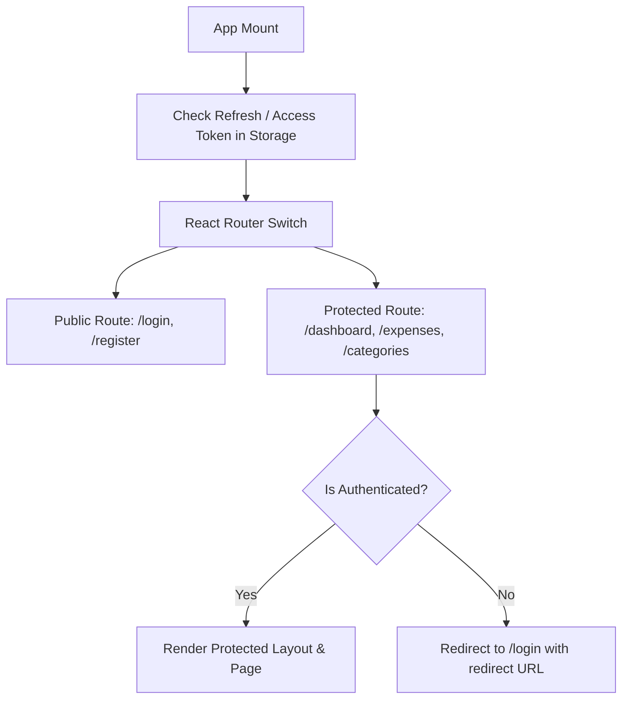

# 06 — Frontend Architecture & State Management

## 1. Core Architectural Pillars

The Expensus frontend is engineered around modern React best practices with strong typing and declarative data fetching:

1. **Vite + React 18 + TypeScript:** Rapid development server, strict compile-time type safety, and optimized production bundling.
2. **Tailwind CSS + shadcn/ui:** Design-token-based styling system using clean utility classes and accessible UI primitives built on Radix UI.
3. **TanStack Query (React Query v5):** Dedicated server-state management for asynchronous queries, mutations, background caching, and optimistic cache invalidation.
4. **React Router v6:** Declarative client-side routing with layout wrappers and authentication route guards.
5. **Axios:** Centralized HTTP client configured with request/response interceptors for automatic JWT injection and automatic 401 refresh handling.

---

## 2. Server State vs. Client State

A common architectural pitfall in React applications is using a global store (like Redux) to hold remote API data. Expensus strictly separates **Server State** from **Client State**:

| Dimension | Server State (TanStack Query) | Client State (React `useState` / `useContext`) |
| :--- | :--- | :--- |
| **Ownership** | Resides remotely on the PostgreSQL database | Resides locally in browser memory |
| **Nature** | Asynchronous, potentially stale, shared | Synchronous, ephemeral, local to user UI |
| **Examples** | Expense list, category options, dashboard metrics | Modal open/close state, active filter inputs, theme |
| **Handling** | `useQuery()`, `useMutation()`, query invalidation | `useState()`, `useReducer()`, local state lifting |

```
                                  +---------------------------------------+
                                  |            React Component            |
                                  +-------------------+-------------------+
                                                      |
                         +----------------------------+----------------------------+
                         |                                                         |
                         v                                                         v
        +---------------------------------+                       +---------------------------------+
        |          Client State           |                       |          Server State           |
        |  - Modal visibility (open/close)|                       |  - Query: fetch expenses list   |
        |  - Active form input values     |                       |  - Mutation: create expense     |
        |  - Selected table rows          |                       |  - Auto-caching & refetching    |
        +---------------------------------+                       +----------------+----------------+
                                                                                   |
                                                                                   v
                                                                  +---------------------------------+
                                                                  |         TanStack Query          |
                                                                  |        QueryClient Cache        |
                                                                  +----------------+----------------+
                                                                                   |
                                                                                   v
                                                                  +---------------------------------+
                                                                  |          Axios Service          |
                                                                  |      (JWT Auth Interceptor)     |
                                                                  +---------------------------------+
```

---

## 3. Directory Layout & Feature Modularization

```text
frontend/src/
├── app/
│   ├── App.tsx              # Root app component
│   ├── AppRouter.tsx        # Route definitions & guards
│   ├── main.tsx             # Entrypoint mounting DOM
│   └── providers.tsx        # Provider composer (QueryClient, AuthProvider)
│
├── features/                # Domain-driven features
│   ├── auth/                # LoginForm, RegisterForm, useAuth hook
│   ├── categories/          # CategoryList, CategoryModal, useCategories query
│   ├── expenses/            # ExpenseTable, ExpenseFormModal, useExpenses query
│   └── dashboard/           # MetricsSummary, MonthlyTrendChart, CategoryPieChart
│
├── components/              # Shared, presentation UI primitives
│   ├── ui/                  # Button, Dialog, Input, Select, Card, Badge, Skeleton
│   ├── layout/              # Navbar, Sidebar, PageContainer, Header
│   └── feedback/            # Toast, ConfirmDialog, EmptyState, ErrorBoundary
│
├── services/                # Network abstractions
│   ├── api.ts               # Axios instance with interceptors
│   ├── authService.ts       # login, register, refresh API calls
│   ├── expenseService.ts    # CRUD endpoints for expenses
│   └── categoryService.ts  # CRUD endpoints for categories
│
└── types/                   # TypeScript interfaces
    ├── auth.ts              # User, AuthTokens, LoginPayload
    ├── category.ts          # Category, CategoryInput
    ├── expense.ts           # Expense, ExpenseInput, ExpenseFilters
    └── api.ts               # PaginatedResponse, ApiError
```

---

## 4. Routing & Protected Route Pattern


